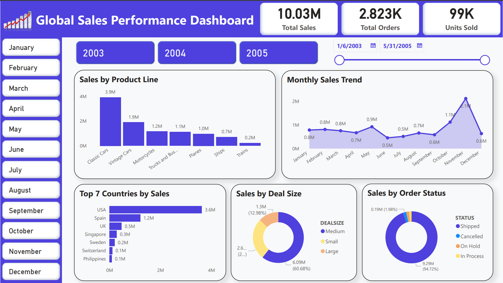

# 📊 Sales Performance Dashboard – Power BI

**A comprehensive and interactive Sales Performance Dashboard built in Microsoft Power BI** to analyze **monthly sales trends, product line performance, and year-over-year comparisons** across three years (2003–2005) using dynamic visual analytics.

This dashboard helps businesses track **sales performance, identify seasonal trends, and compare product line contributions** to support data-driven sales strategies.

---

## 🚀 Features

### 🎛️ Interactive Filters
Analyze sales data dynamically using Power BI slicers and filters:
- **Year Selection:** 2003, 2004, 2005  
- **Month Selection:** January to December  
- **Product Line Segmentation:** Breakdown by product categories  
- **Sales Range Filtering:** Adjustable thresholds for performance analysis  

---

## 📊 Key Performance Indicators (KPIs)

| Metric | Description |
|--------|-------------|
| **Total Sales (2003–2005)** | Cumulative revenue across all product lines |
| **Year-over-Year Growth** | Percentage change between consecutive years |
| **Monthly Sales Trend** | Visualized progression across 36 months |
| **Top Performing Product Line** | Highest revenue-generating category |
| **Sales Volatility Index** | Measure of monthly sales consistency |

---

## 📈 Visual Analytics

- **Monthly Sales Trend (2003–2005)**  
  Line chart displaying sales progression across three years, highlighting seasonal peaks and troughs.

- **Sales by Product Line**  
  Bar chart comparing revenue contributions from different product categories.

- **Yearly Comparison Matrix**  
  Side-by-side analysis of annual performance with growth indicators.

- **Monthly Breakdown Dashboard**  
  Detailed view of monthly sales with drill-down capability to daily trends.

- **Performance Heatmap**  
  Visual representation of high and low sales periods across the timeline.

---

## 🔧 Technical Implementation

### Power BI Tools Used
- Power Query for data transformation and cleaning  
- DAX measures for advanced calculations and KPIs  
- Interactive slicers and timeline filters  
- Custom visuals and theme formatting  
- Drill-through pages for detailed analysis  

### Data Preparation
- Data consolidation from multiple sources (2003–2005)  
- Time intelligence functions for trend analysis  
- Product line categorization and segmentation  
- Sales normalization and outlier handling  

---

## 🖱️ How to Use

1. Open the Power BI dashboard file (.pbix) in **Power BI Desktop**.  
2. Use the **year slicer** to focus on specific years (2003, 2004, or 2005).  
3. Select **product lines** to filter by specific categories.  
4. Hover over trend lines to see detailed monthly sales figures.  
5. Use the **drill-down** feature in monthly views for granular insights.  
6. Export any visual to PowerPoint or PDF for reporting.

---

## 🔍 Business Insights

- **Seasonal Patterns** are evident with consistent peaks in Q4 across all years.  
- **Product Line B** shows the highest year-over-year growth (2003–2005).  
- **2005** recorded the highest overall sales, indicating successful growth strategies.  
- **Monthly volatility** decreased over time, suggesting improved sales forecasting and inventory management.

---

## 📌 Summary

This **Sales Performance Dashboard in Power BI** demonstrates advanced skills in **data modeling, time series analysis, and interactive business intelligence**.  
It showcases how Power BI can transform multi-year sales data into **actionable insights for revenue optimization and strategic planning**.

----

## 🌐 Portfolio Website
Explore more of my data analytics projects:  
👉 https://abdulrazzaq-analyst.github.io/Portfolio_Website/

---

## 📞 Contact
For questions or collaboration:  
📧 abdulrazzaq.analytics@gmail.com  
🔗 https://github.com/abdulrazzaq-analyst

---

## 👤 Author
**Abdul Razzaq**  
Statistics Graduate | Data Analytics & Visualization  
🔗 GitHub: https://github.com/abdulrazzaq-analyst

---

*Note: This dashboard uses sample sales data from 2003–2005 for demonstration purposes. All figures are representative and formatted for analytical clarity.*
